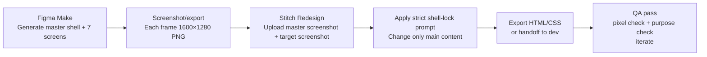

# Designing a Unified, High-Consistency SkyHub Admin UI

## Executive summary

A unified admin UI for cargo + logistics operations succeeds when it behaves like a single coherent instrument panel: the same shell, same interaction patterns, and the same visual grammar everywhere—while each menu has a sharply distinct operational purpose (no duplicate “overview” pages, no “half-dashboard” widgets leaking into work screens). This is especially critical for ops staff who monitor changing states and handle exceptions under time pressure; consistency reduces cognitive load and prevents “UI surprise” errors. citeturn0search0turn0search4

This report provides:
- A cleaned, non-redundant information architecture (Dashboard, Cargo, Logistics, Reports, Logs, Settings) with rationale grounded in usability heuristics and enterprise patterns. citeturn0search0turn0search4  
- A research-backed product brief (ops roles + prioritized tasks) tied to real-world cargo artifacts like the Air Waybill (AWB) and execution monitoring practices from major transportation-management systems. citeturn1search0turn2search0turn2search1turn2search2  
- A single global pixel-locked shell spec (1600×1280) and a design-token table (with example CSS variables) to enforce repeatability. Design tokens are a standard, widely used approach for keeping UI properties consistent across surfaces and over time. citeturn5search0turn5search2  
- An “ultimate prompt pack” for both Figma Make and Stitch (Redesign flow), including master constraints and strict negative prompts to reduce drift and prevent the “hybrid page” failure mode. citeturn0search0turn0search4  
- A practical implementation workflow (Figma Make → screenshot → Stitch Redesign) with an asset checklist.

The core design philosophy is: **one shell; seven distinct page purposes; table-first operational density where appropriate; exception-first visibility; auditability by default**. Dashboards must be at-a-glance and actionable, while dense tables are appropriate when users must scan, compare, and filter operational data. citeturn3search0turn3search1turn3search25

## Operational context and prioritized user tasks

### Who this product serves

This UI targets desktop-only operational staff:
- Ops lead (monitor throughput, spot risk, intervene on exceptions)
- Warehouse/staging (verify receipt, stage, load readiness)
- Dispatch/execution (coordinate handoffs, pickups/deliveries/transfers, track planned vs actual)

These roles map to the common transportation-management split between **planning/execution monitoring** and **exception handling** (planned vs actual, diverting, expediting, tracking & tracing). citeturn2search0turn2search1turn2search2

### Prioritized functional goals and user tasks

The following list is ordered by “how often + how time-critical” for an ops environment:

**Maintain operational visibility (fast scanning, minimal clicks).**  
Dashboards exist to deliver an at-a-glance picture of what needs attention and what is changing, enabling quick action. citeturn3search0

**Find a shipment instantly using AWB and related identifiers.**  
The Air Waybill (AWB) is a critical air cargo document (contract of carriage) and central tracking artifact; operational UIs must make AWB lookup frictionless and ubiquitous. citeturn1search0turn1search3

**Progress shipments through operational states and handle exceptions.**  
Execution work requires tracking states, confirming activities, and managing exceptions (planned vs actual, holds, delays, expediting). citeturn2search0turn2search5

**Coordinate movement execution and handoffs.**  
Transportation and execution monitoring commonly includes tracking/tracing of freight documents and events (planned vs actual). citeturn2search1turn2search5

**Filter large lists to the “next actionable subset.”**  
Filters reduce large sets to what matters; best practice is to provide only the filters users truly need and keep them consistent. citeturn3search6turn3search22

**Use dense, scan-friendly data tables for work surfaces.**  
Data tables exist because they are easy to scan for comparison and lookup, especially in operational contexts; higher density is appropriate when users must compare lots of values. citeturn3search1turn3search25

**Export and report operational performance without turning Reports into a second Dashboard.**  
Reports should be structured, filterable, exportable, and separate from operational execution work. citeturn0search4turn3search0

**Provide a trustworthy audit trail.**  
Audit/log surfaces must answer who did what, when (and ideally where/from what client), aligning with security log management guidance and common audit-log field expectations. citeturn0search7turn1search1turn4search0turn4search17

## Information architecture and page specifications

### Cleaned information architecture

The goal is to remove redundant navigation that causes “page purpose drift” (Cargo becoming Dashboard-like, Logistics becoming Cargo-like). Consistency and minimalist design reduce confusion and speed learning. citeturn0search0turn0search4

**Top-level menu (final):**
- Dashboard
- Cargo
- Logistics
- Reports
- Logs
- Settings

**Removed/merged from top-level (recommended):**
- Fleet → merge into Logistics as a *module/tab* (only if needed)
- Inventory → if needed, becomes a *sub-feature* inside Cargo (e.g., “Warehouse stock / storage”), not a core nav item
- Analytics → rename to Reports (avoid “Analytics vs Reports” split)
- Support / Help Center → footer link or avatar menu, not primary nav
- Sign Out → avatar menu only (never as sidebar primary)

This follows the principle that navigation should represent distinct tasks and mental models, not internal org/feature ownership; duplication increases cognitive load and slows users. citeturn0search0turn0search4

### Rationale for merging/removing items

- **Analytics vs Reports**: Users interpret both as “numbers & charts.” Keeping both creates decision friction and redundancy. Dashboards are for monitoring; Reports are for analysis/export. citeturn3search0turn0search4  
- **Fleet**: If fleet/vehicle visibility is needed, it is typically part of execution monitoring (Logistics). Keeping Fleet as a separate top-level item often duplicates “active units” views already present in Logistics. citeturn2search1turn2search5  
- **Inventory**: Unless you are a full WMS, “inventory” commonly overlaps with cargo storage/staging states; if you do have warehouse processes, they are operationally tied to Cargo/Logistics, not a standalone analytics dashboard. citeturn1search14turn3search25  
- **Support / Sign Out**: Primary nav should prioritize frequent operational tasks; rarely used actions belong in less prominent zones (footer/profile). citeturn0search4  

### Per-menu feature specification

The tables below define the required purpose, required modules, forbidden modules, and UX notes. The “forbidden” lists exist to prevent the most common failure: pages becoming hybrids.

#### Login

| Category | Spec |
|---|---|
| Purpose | Authenticate ops staff into the workspace with minimal friction; establish brand trust. |
| Required modules | Logo + product name, tagline, email, password, “Remember me”, “Forgot password”, primary Sign In, validation/errors, subtle version/footer. |
| Forbidden modules | Marketing sections, multi-tab onboarding, analytics panels, dashboard widgets, multiple brand names. |
| UX notes | Keep form focus and legibility high. Use strong hierarchy, clear error states, and predictable input behavior. Consistency and error prevention principles apply. citeturn0search4 |

#### Dashboard

| Category | Spec |
|---|---|
| Purpose | At-a-glance operational monitoring and “what needs attention now.” Dashboards are single-page overviews enabling quick action. citeturn3search0 |
| Required modules | KPI strip (4 cards), exception/hold count, today’s cutoff risks, recent updates, “priority actions” list, compact recent shipments table. |
| Forbidden modules | Cargo intake forms, deep airline/manifest editing, full logistics dispatch boards, full audit log table, settings forms. |
| UX notes | Avoid information overload; show only metrics that lead to action. Use preattentive cues sparingly (color for exceptions, not decoration). citeturn3search0turn0search4 |

#### Cargo

| Category | Spec |
|---|---|
| Purpose | Manage shipment records and cargo intake; AWB-centric tracking and handling states. The AWB is a critical cargo document and tracking anchor. citeturn1search0turn1search3 |
| Required modules | AWB global search; filter row (status, origin, destination, date); primary cargo ledger table; shipment detail drawer/panel (single); cargo status progression; cargo actions (edit, mark received, hold, request clarification). |
| Forbidden modules | Dashboard KPI strip clones; routing/dispatch timeline boards; “active vehicles” fleet widgets; heavy analytics charts; duplicated “priority actions tower” that turns Cargo into a dashboard. |
| UX notes | Table-first, scan-friendly density. Data tables are meant for fast scanning and comparison; enable filtering and consistent columns. citeturn3search1turn3search25turn3search22 |

#### Logistics

| Category | Spec |
|---|---|
| Purpose | Execution monitoring and coordination: staging, readiness, loading/cutoff, transfers, pickups/deliveries, planned vs actual. Execution monitoring and exception handling are core TMS functions. citeturn2search1turn2search0turn2search5 |
| Required modules | Operational state cards (warehouse/staging/ready/cutoff risk/exception), execution queue table, task assignment, per-task details, exception queue, optional compact “active units” panel if truly needed. |
| Forbidden modules | Cargo record intake, AWB master editing as the primary focus, report-style analytic dashboards, audit log history tables. |
| UX notes | Make exceptions prominent. Support fast “work the queue.” Use filters only users need and keep them consistent. citeturn3search6turn3search22 |

#### Reports

| Category | Spec |
|---|---|
| Purpose | Structured reporting, trends, exports; not operational execution. |
| Required modules | Filter card (date range, route, station, status), export controls, 2–3 summary metrics, 1–2 charts, report table. |
| Forbidden modules | Cargo intake actions, logistics dispatch boards, real-time execution queues, audit tables. |
| UX notes | Reports should be stable, comparable over time, and export-friendly. Avoid turning Reports into a second Dashboard. citeturn3search0turn0search4 |

#### Logs

| Category | Spec |
|---|---|
| Purpose | Audit trail and activity history: who did what, when, where/context; support investigations and compliance. Security log management guidance emphasizes robust, structured logging practices. citeturn0search7turn1search1 |
| Required modules | Filter row (time range, actor, action, target), search, dense audit log table, export. Table fields: timestamp, actor, action, target, outcome, metadata (e.g., client/source). Cloud audit logs emphasize “who did what, where, and when.” citeturn4search17turn4search0 |
| Forbidden modules | KPI strips, route performance charts, cargo intake forms, settings cards. |
| UX notes | Dense but readable rows. Provide consistent timestamps and clear action verbs. Audit logs should stand alone as evidence. citeturn0search7turn1search1 |

#### Settings

| Category | Spec |
|---|---|
| Purpose | Day-to-day preferences and operational defaults; keep it small and practical. |
| Required modules | Profile, default station/airport, timezone/date format, notification preferences, UI density toggle (“Compact tables”), save + toast confirmation. |
| Forbidden modules | Billing, complex admin console, developer settings, mega-tab sprawl, reports/analytics. |
| UX notes | Minimize cognitive load. Defaults should reduce repetitive work in Cargo/Logistics. Keep form patterns consistent with the rest of the system. citeturn0search4turn0search0 |

## Unified shell and design system specification

### Why a tokenized, fixed shell is the “single source of truth”

A high-consistency UI is easiest to maintain when key visual decisions (colors, spacing, typography, radii, sizes) are captured as design tokens and reused everywhere; design-token approaches are explicitly intended to track changes and preserve consistency across surfaces. citeturn5search2turn5search0

Also, using an 8px-based spacing approach reduces variability and supports consistent rhythm (common in major design systems). citeturn0search1turn0search13

### Global shell coordinates for desktop canvas 1600×1280

These are absolute coordinates to lock the shell so that every screen can be reproduced deterministically.

| Element | x | y | w | h | Notes |
|---|---:|---:|---:|---:|---|
| Canvas | 0 | 0 | 1600 | 1280 | Desktop-only |
| Sidebar (fixed) | 0 | 0 | 360 | 1280 | Primary nav + footer links |
| Header (fixed) | 360 | 0 | 1240 | 88 | “Glass” header region; sits above content |
| Main content container | 408 | 120 | 1184 | 1136 | 48px left padding from sidebar edge + top offset |
| Content safe right edge | 1592 | — | — | — | 8px right margin for pixel safety |

**Interpretation:** The shell is fully defined by (sidebar width, header height, content origin). Everything else is built inside the content container with a consistent grid and spacing scale.

### Grid and spacing scale

- Content container uses **12 columns**, **16px gutters**, **column width 84px** (because 12×84 + 11×16 = 1184).  
- Spacing scale (px): 4, 8, 12, 16, 20, 24, 32, 40, 48, 64.  
- Default page vertical rhythm: 24px between major sections, 16px between related controls.  
These patterns align with common guidance to use consistent spacing increments (often 8dp/4dp in major systems). citeturn0search1turn0search13turn3search25

### Component geometry tokens

Operational UIs benefit from predictable touch/click targets and consistent densities; while your UI is desktop-only, using disciplined target sizes improves usability and reduces misclicks. Apple’s guidance for hit regions (44×44pt) and major systems’ target guidance support using sufficiently large controls as a baseline. citeturn0search6turn0search22

| Token | Value | Usage |
|---|---:|---|
| Card radius | 14px | Main containers/cards |
| Control radius | 12px | Inputs, selects, buttons |
| Input height | 40px | Text fields, selects |
| Primary button height | 40px | Primary actions |
| Secondary/small button height | 32px | Row actions, compact toolbars |
| Table header height | 44px | Table head row |
| Table row height | 52px | Dense but readable ops tables |
| Icon size | 20px (inline), 24px (standalone) | Consistent icon rhythm |
| Avatar size | 40px | Header user control |
| Badge height | 24px | Status pills |

### Typography tokens

| Token | Size | Weight | Example use |
|---|---:|---:|---|
| Display / Page title | 36px | 700 | “Cargo”, “Logistics” |
| Section title | 20px | 600 | Card headers |
| KPI number | 32px | 800 | Metric cards |
| Body | 14px | 400 | Default text |
| Table text | 13px | 400 | Dense table content |
| Meta label | 11px | 700 / uppercase | Caps labels with tracking |

**Font pairing (recommended):**
- Headings: Manrope
- Body: Inter  
This pairing supports high-density readability while keeping headings distinctive (common practice in enterprise UI systems).

### Color tokens

Use semantic tokens and avoid ad-hoc colors. Ensure text contrast meets accessibility expectations (WCAG AA: 4.5:1 for normal text). citeturn4search3turn4search7

| Token | Hex | Usage |
|---|---|---|
| `--bg` | `#F7F9FD` | Page background |
| `--surface` | `#FFFFFF` | Card surfaces |
| `--surface-2` | `#F2F4F8` | Input wells, soft panels |
| `--text` | `#181C1F` | Primary text |
| `--text-2` | `#5B6472` | Secondary text |
| `--border-soft` | `#E0E5F0` | Optional subtle borders (if needed) |
| `--primary-700` | `#003D9B` | Core brand/action |
| `--primary-600` | `#0052CC` | CTA gradient end |
| `--primary-500` | `#0059CF` | Active nav icon/accent |
| `--success` | `#1F9D55` | Success |
| `--warning` | `#C97A00` | Warning |
| `--danger` | `#C62828` | Danger |

### Icon family and usage

Use one icon family: **Material Symbols Outlined** (outlined style, consistent stroke/weight). This is aligned with the approach of using a single standard set for consistency and recognition. citeturn0search0turn3search1

### Logo + avatar placement coordinates

**Sidebar logo block**
- Logo container: x=24, y=24, w=312, h=72  
- Logo mark (icon): x=24, y=32, w=40, h=40  
- Wordmark “SkyHub”: x=72, y=30  
- Sub-brand line (optional): x=72, y=56 (“Operations”)

**Header user block**
- Avatar: x=1536, y=24, w=40, h=40  
- User name line: right-aligned ending at x=1520, y=26  
- Role line: right-aligned ending at x=1520, y=48  
- Utility icons row (bell/help/gear): start x=1216, y=28, each 32×32, spacing 12px

**Header search**
- Search bar: x=408, y=24, w=448, h=40, radius=999  
- Placeholder: “Search AWB, manifest, or flight…”

### Example CSS variables

```css
:root{
  /* Canvas */
  --canvas-w: 1600px;
  --canvas-h: 1280px;

  /* Shell */
  --sidebar-w: 360px;
  --header-h: 88px;
  --content-x: 408px;
  --content-y: 120px;
  --content-w: 1184px;

  /* Grid */
  --grid-cols: 12;
  --grid-gutter: 16px;
  --grid-col-w: 84px;

  /* Spacing */
  --s-1: 4px;
  --s-2: 8px;
  --s-3: 12px;
  --s-4: 16px;
  --s-5: 20px;
  --s-6: 24px;
  --s-8: 32px;
  --s-10: 40px;
  --s-12: 48px;
  --s-16: 64px;

  /* Radii */
  --r-card: 14px;
  --r-ctl: 12px;
  --r-pill: 999px;

  /* Sizes */
  --h-input: 40px;
  --h-btn: 40px;
  --h-btn-sm: 32px;
  --h-row: 52px;
  --h-th: 44px;
  --sz-icon: 20px;
  --sz-avatar: 40px;
  --h-badge: 24px;

  /* Color */
  --bg: #F7F9FD;
  --surface: #FFFFFF;
  --surface-2: #F2F4F8;
  --text: #181C1F;
  --text-2: #5B6472;
  --border-soft: #E0E5F0;

  --primary-700: #003D9B;
  --primary-600: #0052CC;
  --primary-500: #0059CF;

  --success: #1F9D55;
  --warning: #C97A00;
  --danger: #C62828;
}

/* CTA gradient */
.cta{
  background: linear-gradient(135deg, var(--primary-700), var(--primary-600));
}
```

## Ultimate prompt pack for Figma Make and Stitch

### Master constraints and negative prompts

Consistency is a usability requirement (not “nice to have”): consistent patterns reduce learning cost and prevent mistakes. citeturn0search0turn0search4

**Master constraints (use in every prompt):**
- “This is **not** a redesign; this is a strict standardization task.”
- “Keep the **exact same shell** across screens: sidebar width, header height, content origin, grid.”
- “Do **not** rename product; use **SkyHub** only.”
- “Use **one icon family** and **one typography scale**.”
- “Cargo ≠ Dashboard; Logistics ≠ Cargo; Reports ≠ Dashboard; Logs = audit only.”
- “Provide only necessary filters.” citeturn3search6turn3search22

**Negative prompts (anti-drift):**
- No “modern redesign,” no “fresh take,” no “creative exploration.”
- No extra menus beyond the 6 top-level items.
- No duplicate KPI strips on work pages.
- No stacked right-side “dashboard towers” in Cargo.
- No heavy charts outside Reports/Dashboard.
- No mixing brand names or creating new logos.
- No changing spacing/radii “to improve aesthetics.”

### Ready-to-paste prompts for Figma Make

#### Figma Make master prompt

```text
You are designing a desktop-only admin web app called “SkyHub” for air cargo and logistics operations.

This is a high-consistency design system task, not a creative redesign.

HARD SHELL LOCK (must be identical on every internal page):
- Canvas: 1600×1280
- Sidebar: x=0 y=0 w=360 h=1280
- Header:  x=360 y=0 w=1240 h=88
- Content container: x=408 y=120 w=1184 h=1136
- Grid inside content: 12 columns, 16px gutter, 84px column width
- Spacing scale (px): 4/8/12/16/20/24/32/40/48/64
- Card radius: 14px
- Control radius: 12px
- Input height: 40px
- Button height: 40px (primary), 32px (small)
- Table header height: 44px; row height: 52px
- Icon family: Material Symbols Outlined only (consistent sizes 20/24)
- Fonts: Manrope for page titles/headings, Inter for body/tables
- Color system (semantic tokens):
  bg #F7F9FD, surface #FFFFFF, surface-2 #F2F4F8,
  text #181C1F, text-2 #5B6472,
  primary #003D9B, primary-2 #0052CC, accent #0059CF,
  success #1F9D55, warning #C97A00, danger #C62828
- Header search: x=408 y=24 w=448 h=40 (pill radius)
- Header avatar: x=1536 y=24 w=40 h=40
- Sidebar logo block: x=24 y=24 w=312 h=72 (SkyHub wordmark + mark)

INFORMATION ARCHITECTURE (sidebar menu order, no extras):
1) Dashboard
2) Cargo
3) Logistics
4) Reports
5) Logs
6) Settings

Functional separation rules (no redundancy):
- Dashboard = overview at-a-glance only
- Cargo = shipment records / AWB-centric cargo handling only
- Logistics = execution coordination only
- Reports = reporting + export only
- Logs = audit trail only
- Settings = day-to-day preferences only

DO NOT:
- Do not rename SkyHub.
- Do not create Fleet/Inventory/Analytics as top-level menus.
- Do not add Support or Sign Out as top-level menus (Sign Out belongs in avatar dropdown).
- Do not mix Dashboard widgets into Cargo.
- Do not turn Reports into another Dashboard.
- Do not add decorative elements without operational purpose.

Now wait for my per-screen instruction.
```

#### Figma Make per-screen prompts

**Login (Figma Make)**

```text
Create the Login screen for SkyHub (Canvas 1600×1280).

Keep brand consistency (SkyHub logo style) but Login does NOT use the internal shell.

Layout:
- Left form panel: x=0 y=0 w=560 h=1280
- Right visual panel: x=560 y=0 w=1040 h=1280
- Left panel padding: 48px
- Login card: x=96 y=280 w=420 h=520 radius 24px padding 32px

Login card modules (required):
- SkyHub logo
- Title “Welcome back”
- Subtitle “Sign in to continue”
- Email input (h=40)
- Password input (h=40)
- Remember me checkbox
- Forgot password link
- Primary button “Sign in” (h=40, gradient primary)
- Helper footer text

Forbidden:
- No marketing sections, no social login, no extra tabs, no dashboard widgets.

Closing instruction:
Make it feel like the same product family as the app, but simpler and form-focused.
```

**Dashboard (Figma Make)**

```text
Create the Dashboard screen using the HARD SHELL LOCK exactly.

Required modules inside content container:
- Page title block: “Dashboard” + 1-line subtitle
- KPI row: 4 equal cards (same height):
  1) Total Shipments
  2) In Warehouse / Staging
  3) Ready to Load / Ready to Fly
  4) Exceptions / Holds
- Row: left trend chart card (shipments over time), right compact card (top routes or stations)
- Row: wide “Recent Shipments” table with filters (minimal) and status pills
- One compact “Priority Actions” list (max 5 items)

Forbidden:
- No Cargo intake form.
- No Logistics dispatch board.
- No full audit log table.
- No settings forms.

Closing instruction:
Dashboard must be at-a-glance and actionable, NOT a second Cargo/Logistics page.
```

**Cargo (Figma Make)**

```text
Create the Cargo screen using the HARD SHELL LOCK exactly.

Purpose:
AWB-centric shipment records, cargo handling status, and cargo actions.

Required modules:
- Page title block: “Cargo” + subtitle
- Filter/action row (compact):
  - Search AWB
  - Status
  - Origin
  - Destination
  - Date
  - Right-side actions: “Filters” (secondary), “New Shipment” (primary)
- Primary full-width card: “Cargo Ledger” table (table-first)
  Columns: AWB, Commodity, Origin, Destination, Pieces, Weight, Volume, Status, Updated, Actions
- Optional: one single detail drawer/panel (not a right-side widget tower)

Forbidden:
- No KPI dashboard strip copied from Dashboard.
- No Logistics execution board.
- No fleet/vehicle panels.
- No heavy charts (Reports only).
- No stacked right-side summary widgets that turn Cargo into a dashboard.

Closing instruction:
Cargo must feel like a work surface (table-forward), visually identical shell, purpose distinct from Logistics.
```

**Logistics (Figma Make)**

```text
Create the Logistics screen using the HARD SHELL LOCK exactly.

Purpose:
Execution coordination: staging, readiness, cutoff risk, transfers, pickup/delivery tasks, exceptions.

Required modules:
- Page title block: “Logistics” + subtitle
- Operational state cards row (4 cards):
  - In Warehouse/Staging
  - Ready to Load
  - Approaching Cutoff
  - Holds / Exceptions
- Main execution queue: large table card
  Columns: AWB, Zone/Location, Flight/Leg, Cutoff, Status, Assigned, Actions
- Right-side column allowed ONLY if balanced:
  - “Shift Priorities” list (compact)
  - “Exception Feed” list (compact)

Forbidden:
- No Cargo intake editor as the main focus.
- No Reports-style analytics dashboard.
- No audit log table.

Closing instruction:
Logistics is execution-oriented, queue-driven, exception-visible, and uses the same exact shell as Cargo.
```

**Reports (Figma Make)**

```text
Create the Reports screen using the HARD SHELL LOCK exactly.

Purpose:
Structured reporting, trends, and export.

Required modules:
- Page title block: “Reports” + subtitle
- Report filter card (date range, station/route, status, report type) + Export button
- 3 summary metric cards (compact)
- 1 trend chart card (left) + 1 breakdown chart card (right)
- Report results table card with export context

Forbidden:
- No operational execution queue (Logistics).
- No Cargo intake actions.
- No full audit log (Logs only).
- Do not become a second Dashboard.

Closing instruction:
Reports must be analytical and exportable, but restrained and consistent with the same shell.
```

**Logs (Figma Make)**

```text
Create the Logs screen using the HARD SHELL LOCK exactly.

Purpose:
Audit trail (who did what, when, on what, outcome).

Required modules:
- Page title block: “Logs” + subtitle
- Compact filter row:
  - Date range
  - Actor (user)
  - Action type
  - Target type
  - Search
  - Export
- Main full-width audit log table (dense, readable):
  Columns: Timestamp, Actor, Role, Action, Target, Result, Metadata (e.g., source/client), Trace/ID

Forbidden:
- No KPI cards and no charts.
- No Cargo or Logistics operational modules.
- No Settings forms.

Closing instruction:
Logs must be table-first, investigation-friendly, and purely audit-focused.
```

**Settings (Figma Make)**

```text
Create the Settings screen using the HARD SHELL LOCK exactly.

Purpose:
Day-to-day settings only.

Required modules (3 main cards, stacked):
1) Profile (name, email, role, team)
2) Operational defaults (default station/airport, timezone, date format)
3) Preferences (notifications, table density toggle, auto-refresh)
- Save Changes primary button + success toast

Forbidden:
- No billing, no admin mega-console, no developer settings.
- No analytics dashboards.
- No audit logs.

Closing instruction:
Settings must remain simple and practical while visually identical to the core shell.
```

### Ready-to-paste prompts for Stitch (Redesign flow)

Stitch Redesign should treat your screenshot as the master “ground truth” and only change the main content as instructed.

#### Stitch master prompt (use once per Redesign session)

```text
Use the uploaded screenshot as the APPROVED VISUAL MASTER for SkyHub.

This is NOT a creative redesign.
This is a strict replication + standardization task.

HARD SHELL LOCK (must remain identical to the master screenshot):
- Do not change canvas size (1600×1280).
- Do not change sidebar width or structure.
- Do not change header height or structure.
- Do not change content container position, grid alignment, spacing rhythm, or component sizing.
- Do not change logo identity, logo placement, or logo proportions.
- Do not change avatar style, avatar placement, or avatar proportions.
- Do not change icon family or icon style.
- Do not change typography scale.
- Do not change color balance.

Information architecture lock:
Sidebar menu order must be exactly:
Dashboard, Cargo, Logistics, Reports, Logs, Settings
No other top-level menus.

Negative constraints:
- Do not rename SkyHub.
- Do not invent Fleet/Inventory/Analytics as top-level menus.
- Do not add “Support” or “Sign Out” as sidebar items.
- Do not merge page purposes.
- Do not add dashboard widgets to work pages unless explicitly requested.

Only modify the MAIN CONTENT AREA for the requested page.
Everything else must remain identical to the approved master screenshot.
```

#### Stitch per-screen prompts (paste one at a time)

**Login (Stitch)**

```text
Create the Login screen for SkyHub.

Shell lock:
- Keep SkyHub brand identity consistent (same logo, same typography feel).
- Do not introduce new brand names.
- Keep the same color system and button style (primary gradient).

Login requirements:
- Left form panel + right visual panel layout.
- Required modules: logo, welcome title, email, password, remember me, forgot password, sign in button.
- No marketing sections, no social login.

Closing instruction:
Match the SkyHub visual language exactly, but keep Login simpler than internal pages.
```

**Dashboard (Stitch)**

```text
Generate the Dashboard main content area only.

Shell lock:
- Everything outside main content must remain identical to the approved master.
- Do not change sidebar/header/logo/avatar/grid/spacing.

Dashboard content:
- KPI row (4 cards): Total Shipments, In Warehouse/Staging, Ready to Load/Fly, Exceptions/Holds
- Trend chart (left) + Top routes/stations (right)
- Recent shipments table
- Priority actions list (max 5)

Forbidden:
- No Cargo intake form.
- No Logistics execution queue.
- No audit table.
- No settings forms.

Closing instruction:
Dashboard must be at-a-glance and actionable, not a duplicate of Cargo or Logistics.
```

**Cargo (Stitch)**

```text
Generate the Cargo main content area only.

Shell lock:
- Everything outside main content must remain identical to the approved master.
- Do not change sidebar/header/logo/avatar/grid/spacing.

Cargo content:
- Purpose: AWB-centric cargo shipment records and handling actions.
- Filter/action row: Search AWB, Status, Origin, Destination, Date + “New Shipment”
- Primary full-width Cargo Ledger table:
  AWB, Commodity, Origin, Destination, Pieces, Weight, Volume, Status, Updated, Actions
- Optional: single detail drawer/panel only (not a right-side widget tower)

Forbidden:
- No dashboard KPI strip clones.
- No logistics dispatch/execution board.
- No fleet/vehicle widgets.
- No heavy analytics charts.

Closing instruction:
Cargo must be table-forward, work-focused, and not feel like a second Dashboard.
```

**Logistics (Stitch)**

```text
Generate the Logistics main content area only.

Shell lock:
- Everything outside main content must remain identical to the approved master.
- Do not change sidebar/header/logo/avatar/grid/spacing.

Logistics content:
- Operational state cards (4): In Warehouse/Staging, Ready to Load, Approaching Cutoff, Holds/Exceptions
- Execution queue table:
  AWB, Zone/Location, Flight/Leg, Cutoff, Status, Assigned, Actions
- Optional compact right column: Shift Priorities + Exception Feed (only if balanced)

Forbidden:
- No cargo intake editor as the main focus.
- No reports-style analytics.
- No audit table.

Closing instruction:
Logistics is execution-oriented and queue-driven; keep it consistent with the same shell as Cargo.
```

**Reports (Stitch)**

```text
Generate the Reports main content area only.

Shell lock:
- Everything outside main content must remain identical to the approved master.
- Do not change sidebar/header/logo/avatar/grid/spacing.

Reports content:
- Filter card: date range, station/route, status, report type + Export
- 3 summary metrics
- 1 trend chart + 1 breakdown chart
- Results table (export-friendly)

Forbidden:
- No execution queues.
- No cargo intake actions.
- No audit table.
- Do not become a second Dashboard.

Closing instruction:
Reports must be analytical, exportable, and restrained.
```

**Logs (Stitch)**

```text
Generate the Logs main content area only.

Shell lock:
- Everything outside main content must remain identical to the approved master.
- Do not change sidebar/header/logo/avatar/grid/spacing.

Logs content:
- Filter row: date range, actor, action, target, search, export
- Dense audit log table:
  Timestamp, Actor, Role, Action, Target, Result, Metadata, Trace/ID

Forbidden:
- No KPIs, no charts.
- No cargo/logistics modules.
- No settings forms.

Closing instruction:
Logs must be investigation-friendly, table-first, and purely audit-focused.
```

**Settings (Stitch)**

```text
Generate the Settings main content area only.

Shell lock:
- Everything outside main content must remain identical to the approved master.
- Do not change sidebar/header/logo/avatar/grid/spacing.

Settings content:
- 3 cards: Profile, Operational defaults, Preferences
- Save Changes primary button + confirmation toast
- Optional compact “Reset” per section

Forbidden:
- No billing, no mega admin console, no developer settings.
- No analytics dashboards.
- No audit table.

Closing instruction:
Settings must be practical and minimal while staying visually identical to the shell.
```

## Workflow checklist and asset recommendations

### Workflow flowchart



### Implementation checklist

**Figma Make stage**
- Create a single “SkyHub Shell” master frame (1600×1280) and duplicate it for every page.
- Change only the main content inside the content container; do not touch sidebar/header/coordinates.
- Verify menu order and naming are identical across pages (Dashboard, Cargo, Logistics, Reports, Logs, Settings).
- Verify Cargo is table-first and not dashboard-like; verify Reports is export/analytics and not execution-like. citeturn3search0turn3search1turn0search4

**Screenshot stage**
- Export/screenshot each frame as a clean 1600×1280 PNG.
- Ensure no browser chrome, no crop, consistent scaling (100%).

**Stitch Redesign stage**
- Upload one “master shell” screenshot (best-looking internal page) + the target screenshot (if you have one).
- Paste Stitch master prompt, then paste the per-page prompt.
- Review for drift: sidebar width, header height, typography scale, icon family, brand name.

**QA stage (fast)**
- Check “no hybrid pages”: Cargo doesn’t have dashboard KPI strips; Logs doesn’t have charts; Reports doesn’t have execution queues.
- Check filter consistency: similar location + style across Cargo/Logistics/Logs. citeturn3search6turn3search22

### Recommended assets to upload and why

**Master internal screenshot (PNG, 1600×1280)**  
Best at forcing shell consistency in Stitch. Use your most correct internal page (often Logistics) as the “shell master.”

**Logo asset (SVG + PNG)**  
SVG ensures the logo never mutates across generations (vector precision) and prevents accidental brand drift.

**Avatar/profile image (PNG, 40×40 and 80×80)**  
A fixed avatar prevents identity/style drift and keeps header composition stable.

**Optional icon snapshot (PNG) showing 6 sidebar icons**  
If you have custom icons, bundle them; otherwise lock to Material Symbols Outlined.

## Prioritized research sources and why they justify key UX choices

These are the most relevant sources to justify the architecture and UX decisions:

- **entity["organization","Nielsen Norman Group","ux research firm"]** on consistency and standards, minimalist design, and dashboard definitions (directly supports the “one shell, no redundancy” approach and dashboard scope). citeturn0search0turn0search4turn3search0  
- **Material Design guidance** on spacing increments (8dp/4dp), layout density, and data tables (supports scan-friendly ops tables and a consistent spacing system). citeturn0search1turn0search13turn3search1turn3search25  
- **entity["company","Microsoft","software company"]** Fluent layout guidance (12-column grid) and D365 transportation-management materials (supports execution monitoring patterns and enterprise layout norms). citeturn3search3turn2search2  
- **entity["company","Apple","consumer electronics company"]** HIG tips on hit targets (supports disciplined control sizing and error reduction). citeturn0search6turn0search22  
- **entity["organization","National Institute of Standards and Technology","us standards agency"]** SP 800-92 for log management (supports why Logs exist and what “good logging” entails). citeturn0search7turn0search3  
- **entity["organization","OWASP","web security nonprofit"]** Logging Cheat Sheet (supports application logging and audit trail design considerations). citeturn1search1  
- **entity["organization","International Air Transport Association","air transport trade association"]** e-AWB/AWB references (supports AWB-centric workflows and Cargo page primacy). citeturn1search0turn1search2  
- **Transportation-management vendor documentation** (why Logistics emphasizes execution, tracking, planned vs actual, and exception management):  
  - SAP TM tracking & tracing and execution monitoring citeturn2search1turn2search5  
  - Oracle OTM exceptions during execution citeturn2search0  
- **entity["organization","World Wide Web Consortium","web standards body"]** Design Tokens Community Group + Material design-tokens guidance (supports the token-first “single source of truth” strategy). citeturn5search0turn5search2  
- Cloud audit-log field expectations used as practical references for log fields (who/what/when + detailed event record contents):  
  - entity["company","Amazon Web Services","cloud provider"] CloudTrail record contents citeturn4search0turn4search4  
  - Google Cloud audit logs “who did what, where, when” framing citeturn4search17